# SchoolSync — System Documentation

> **Version**: 1.0 | **Last Updated**: March 24, 2026  
> **Stack**: NestJS · Next.js 14 · React Native (Expo) · Prisma · SQLite/PostgreSQL · Socket.IO

---

## Table of Contents

1. [System Overview](#1-system-overview)
2. [App Structure](#2-app-structure)
3. [Software Architecture](#3-software-architecture)
4. [Backend Workflow](#4-backend-workflow)
5. [Frontend Workflow](#5-frontend-workflow)
6. [Authentication & Authorization Flow](#6-authentication--authorization-flow)
7. [Attendance Workflow](#7-attendance-workflow)
8. [Data Flow Charts (Mermaid)](#8-data-flow-charts-mermaid)
9. [Database Schema](#9-database-schema)
10. [Security Architecture](#10-security-architecture)
11. [API Endpoint Reference](#11-api-endpoint-reference)
12. [Deployment Architecture](#12-deployment-architecture)

---

## 1. System Overview

**SchoolSync** is a full-stack attendance management system designed for schools in Cambodia. It supports QR-code-based attendance scanning for both students and staff, real-time WebSocket updates, role-based dashboards, custom ID card design, comprehensive reporting with CSV/XLSX exports, and parent notifications via email (SendGrid) and SMS (Twilio).

### Key Capabilities

| Feature | Description |
|---------|-------------|
| **QR Attendance** | Scan student/staff QR codes via web camera or mobile app |
| **4-Session Model** | Morning Check-In, Morning Check-Out, Afternoon Check-In, Afternoon Check-Out |
| **Auto-Late Detection** | Marks students/staff as LATE if scan occurs >20 min after session start |
| **Auto Day-Off** | Respects class weekly schedules and holidays calendar |
| **Real-Time Updates** | WebSocket push to teacher dashboards when attendance is recorded |
| **ID Card Designer** | Drag-and-drop canvas editor with template system, PDF/PNG export |
| **Multi-Format Reports** | Daily/Weekly/Monthly/Yearly views, CSV and XLSX exports (multi-sheet) |
| **Parent Notifications** | Automated email & SMS when a student is marked absent |
| **GPS Logging** | Records scan location with latitude, longitude, and reverse-geocoded label |
| **Bulk Operations** | CSV import for students, bulk user registration, bulk attendance marking |

### User Roles

| Role | Access Level |
|------|-------------|
| **ADMIN** | Full system access — user management, all classes, all reports, audit logs, system settings |
| **TEACHER** | Own classes, attendance scanning, staff attendance, reports for own classes |
| **STUDENT** | View own attendance history, download personal report |
| **PARENT** | Receive absence notifications (email/SMS) |
| **Other Staff Roles** | PRINCIPAL, VICE_PRINCIPAL, OFFICER, LIBRARIAN, SECURITY, etc. — scanned as staff |

---

## 2. App Structure

### Full Project Directory Tree

```
SchoolSystem01/
├── package.json                          # Root monorepo config (Turborepo)
├── turbo.json                            # Turborepo pipeline configuration
├── docker-compose.yml                    # PostgreSQL 15 + Redis 7 services
├── schema.prisma                         # Root Prisma schema reference
├── tailwind.config.js                    # Root Tailwind config
├── check-db.js                           # Database connectivity check script
├── README.md                             # Project readme
├── SYSTEM_DOCUMENTATION.md               # This document
├── ATTENDANCE_FAQ.md                     # Attendance FAQ guide
├── ATTENDANCE_INFOGRAPHIC.md             # Visual attendance infographic
├── ATTENDANCE_QUICK_REFERENCE.md         # Quick reference card
├── ATTENDANCE_SCANNING_GUIDE.md          # Scanner usage guide
├── TRAINING_VIDEO_SCRIPT.md              # Training video script
│
├── apps/
│   │
│   ├── api/                              # ──── NestJS Backend API ────
│   │   ├── package.json
│   │   ├── tsconfig.json
│   │   ├── .env                          # Environment variables
│   │   ├── .env.example                  # Env template
│   │   └── src/
│   │       ├── main.ts                   # Entry point (Helmet, CORS, rate-limit, validation)
│   │       ├── app.module.ts             # Root module (imports all feature modules)
│   │       ├── app.controller.ts         # Health check + image proxy endpoint
│   │       ├── app.service.ts            # Root service
│   │       │
│   │       ├── auth/                     # 🔐 Authentication & User Management
│   │       │   ├── auth.module.ts        # Passport + JWT + DB wiring
│   │       │   ├── auth.controller.ts    # Login, register, refresh, users CRUD
│   │       │   ├── auth.service.ts       # bcrypt, JWT signing, token rotation
│   │       │   ├── jwt.strategy.ts       # Passport JWT strategy (cookie + header)
│   │       │   ├── jwt-auth.guard.ts     # JWT authentication guard
│   │       │   ├── roles.decorator.ts    # @Roles() metadata decorator
│   │       │   ├── roles.guard.ts        # Role-based access control guard
│   │       │   └── dto/
│   │       │       ├── login.dto.ts       # Email + password validation
│   │       │       └── register.dto.ts   # Registration DTO with role whitelist
│   │       │
│   │       ├── attendance/               # 📋 Student & Staff Attendance
│   │       │   ├── attendance.module.ts  # Imports: DB, Notification, SessionConfig
│   │       │   ├── attendance.controller.ts  # Record, bulk, check-out, staff, admin edit
│   │       │   ├── attendance.service.ts     # Auto-late, day-off, GPS, idempotent upsert
│   │       │   └── attendance.gateway.ts     # Socket.IO real-time attendance updates
│   │       │
│   │       ├── classes/                  # 🏫 Class & Student Management
│   │       │   ├── classes.module.ts
│   │       │   ├── classes.controller.ts # CRUD classes, add/remove students, CSV import
│   │       │   └── classes.service.ts    # CSV parsing, bulk student creation
│   │       │
│   │       ├── reports/                  # 📊 Reports & Exports
│   │       │   ├── reports.module.ts     # Imports: DB, SessionConfig, Holidays
│   │       │   ├── reports.controller.ts # 18 endpoints: grids, totals, CSV, XLSX
│   │       │   └── reports.service.ts    # ~1750 lines: aggregation, export generation
│   │       │
│   │       ├── holidays/                 # 📅 Holiday Calendar
│   │       │   ├── holidays.module.ts
│   │       │   ├── holidays.controller.ts # CRUD + date check
│   │       │   └── holidays.service.ts
│   │       │
│   │       ├── session-config/           # ⚙️ Session Time Configuration
│   │       │   ├── session-config.module.ts
│   │       │   ├── session-config.controller.ts # Global, per-class, staff configs
│   │       │   └── session-config.service.ts    # Defaults + hierarchical override
│   │       │
│   │       └── notification/             # 🔔 Parent Notifications
│   │           ├── notification.module.ts
│   │           └── notification.service.ts  # SendGrid email + Twilio SMS
│   │
│   ├── web/                              # ──── Next.js 14 Web Frontend ────
│   │   ├── package.json
│   │   ├── next.config.js                # Standalone output, security headers, API proxy
│   │   ├── tailwind.config.js
│   │   ├── postcss.config.js
│   │   ├── tsconfig.json
│   │   │
│   │   ├── lib/                          # Shared utilities
│   │   │   ├── api.ts                    # apiFetch() with auto token refresh
│   │   │   ├── admin-nav.ts              # 15 admin sidebar navigation items
│   │   │   └── teacher-nav.ts            # 7 teacher sidebar navigation items
│   │   │
│   │   ├── components/                   # Reusable components
│   │   │   ├── AuthGuard.tsx             # Auth HOC with role verification
│   │   │   ├── Sidebar.tsx               # Responsive sidebar with color themes
│   │   │   └── card-designer/            # ID Card Designer system
│   │   │       ├── types.ts              # Card design interfaces, fonts, presets
│   │   │       ├── CardEditor.tsx         # Template management + export controls
│   │   │       ├── CardCanvas.tsx         # Interactive drag/resize/rotate canvas
│   │   │       ├── Toolbar.tsx            # Right sidebar: text, logos, shapes, QR
│   │   │       ├── renderDesignToCanvas.ts # 300 DPI canvas rendering engine
│   │   │       └── generateCardPDF.ts     # PDF generation (single + A4 multi-card)
│   │   │
│   │   ├── public/
│   │   │   └── favicon.svg
│   │   │
│   │   └── app/                          # Next.js App Router pages
│   │       ├── layout.tsx                # Root layout (fonts: Inter + Khmer)
│   │       ├── page.tsx                  # Landing page (3 portal cards)
│   │       ├── styles.css                # Tailwind + custom component styles
│   │       │
│   │       ├── login/
│   │       │   └── page.tsx              # Login form → role-based redirect
│   │       │
│   │       ├── admin/                    # 👑 Admin Portal (16 pages)
│   │       │   ├── page.tsx              # Dashboard — 10 quick action cards
│   │       │   ├── dashboard/
│   │       │   │   └── page.tsx          # Analytics — pie/bar charts (Recharts)
│   │       │   ├── search/
│   │       │   │   └── page.tsx          # Full-text user search
│   │       │   ├── users/
│   │       │   │   └── page.tsx          # User CRUD + CSV import/export
│   │       │   ├── classes/
│   │       │   │   └── page.tsx          # Class management + student assignment
│   │       │   ├── attendance/
│   │       │   │   ├── page.tsx          # QR scanner (GPS, session presets)
│   │       │   │   └── edit/
│   │       │   │       └── page.tsx      # Spreadsheet attendance editor
│   │       │   ├── staff-attendance/
│   │       │   │   ├── page.tsx          # Staff QR scanner
│   │       │   │   └── edit/
│   │       │   │       └── page.tsx      # Staff attendance grid editor
│   │       │   ├── reports/
│   │       │   │   └── page.tsx          # Student reports + XLSX export
│   │       │   ├── staff-reports/
│   │       │   │   └── page.tsx          # Staff reports + XLSX export
│   │       │   ├── qr-codes/
│   │       │   │   └── page.tsx          # ID card generator with live preview
│   │       │   ├── card-designer/
│   │       │   │   └── page.tsx          # Standalone card template editor
│   │       │   ├── holidays/
│   │       │   │   └── page.tsx          # Holiday calendar (month view)
│   │       │   ├── session-settings/
│   │       │   │   └── page.tsx          # Global session time configuration
│   │       │   ├── notifications/
│   │       │   │   └── page.tsx          # Email/SMS notification settings
│   │       │   ├── audit/
│   │       │   │   └── page.tsx          # Audit log viewer
│   │       │   └── settings/
│   │       │       └── page.tsx          # Cache/storage management
│   │       │
│   │       ├── teacher/                  # 👩‍🏫 Teacher Portal (7 pages)
│   │       │   ├── page.tsx              # Dashboard — my classes overview
│   │       │   ├── classes/
│   │       │   │   └── page.tsx          # My classes + student management
│   │       │   ├── attendance/
│   │       │   │   └── page.tsx          # QR scanner (own classes only)
│   │       │   ├── staff-attendance/
│   │       │   │   └── page.tsx          # Staff QR scanner
│   │       │   ├── reports/
│   │       │   │   └── page.tsx          # Attendance grid + CSV export
│   │       │   ├── staff-reports/
│   │       │   │   └── page.tsx          # Staff reports
│   │       │   └── session-settings/
│   │       │       └── page.tsx          # Per-class session override
│   │       │
│   │       └── student/                  # 🎓 Student Portal (1 page)
│   │           └── page.tsx              # Attendance history + stats + CSV download
│   │
│   └── mobile/                           # ──── React Native (Expo) Mobile App ────
│       ├── app.json                      # Expo config (camera, secure-store, dark mode)
│       ├── package.json
│       ├── tsconfig.json
│       ├── index.ts                      # Entry point — registers App component
│       ├── App.tsx                       # Auth check → Login or Scanner
│       ├── assets/
│       │   ├── icon.png
│       │   ├── favicon.png
│       │   ├── splash-icon.png
│       │   ├── android-icon-background.png
│       │   ├── android-icon-foreground.png
│       │   └── android-icon-monochrome.png
│       └── src/
│           ├── api.ts                    # Auth API + SecureStore token management
│           ├── config.ts                 # API_BASE_URL configuration
│           └── screens/
│               ├── LoginScreen.tsx        # Email/password + haptic feedback
│               └── ScannerScreen.tsx      # QR camera — class/session/mode select
│
└── packages/
    ├── database/                         # ──── Shared Database Package ────
    │   ├── package.json
    │   ├── tsconfig.json
    │   ├── index.js                      # Package entry point
    │   ├── prisma.config.ts              # Prisma configuration
    │   ├── schema.prisma                 # Database schema (9 models)
    │   ├── dev.db                        # SQLite development database
    │   └── src/
    │       ├── database.module.ts         # NestJS DatabaseModule (PrismaService)
    │       ├── prisma.service.ts          # PrismaClient with lifecycle hooks
    │       └── seed.ts                    # Database seed script
    │
    └── shared/                           # ──── Shared Types Package ────
        └── (reserved for shared types/utilities)
```

### Structure Summary

| Area | Files | Description |
|------|------:|-------------|
| **Backend API** (`apps/api/src/`) | 22 files | 7 feature modules + core files |
| **Web Frontend** (`apps/web/`) | 35+ files | 24 pages across 3 portals + 8 components |
| **Mobile App** (`apps/mobile/`) | 8 files | 2 screens + API layer + assets |
| **Database Package** (`packages/database/`) | 7 files | Prisma schema, module, service, seed |
| **Root Config** | 14 files | Monorepo config + documentation |

### Module-to-File Mapping

| Backend Module | Controller | Service | Extra Files |
|----------------|-----------|---------|-------------|
| **Auth** | `auth.controller.ts` | `auth.service.ts` | `jwt.strategy.ts`, `jwt-auth.guard.ts`, `roles.guard.ts`, `roles.decorator.ts`, 2 DTOs |
| **Attendance** | `attendance.controller.ts` | `attendance.service.ts` | `attendance.gateway.ts` (WebSocket) |
| **Classes** | `classes.controller.ts` | `classes.service.ts` | — |
| **Reports** | `reports.controller.ts` | `reports.service.ts` (~1750 LoC) | — |
| **Holidays** | `holidays.controller.ts` | `holidays.service.ts` | — |
| **Session Config** | `session-config.controller.ts` | `session-config.service.ts` | — |
| **Notification** | — | `notification.service.ts` | — |

---

## 3. Software Architecture

### High-Level Architecture Diagram

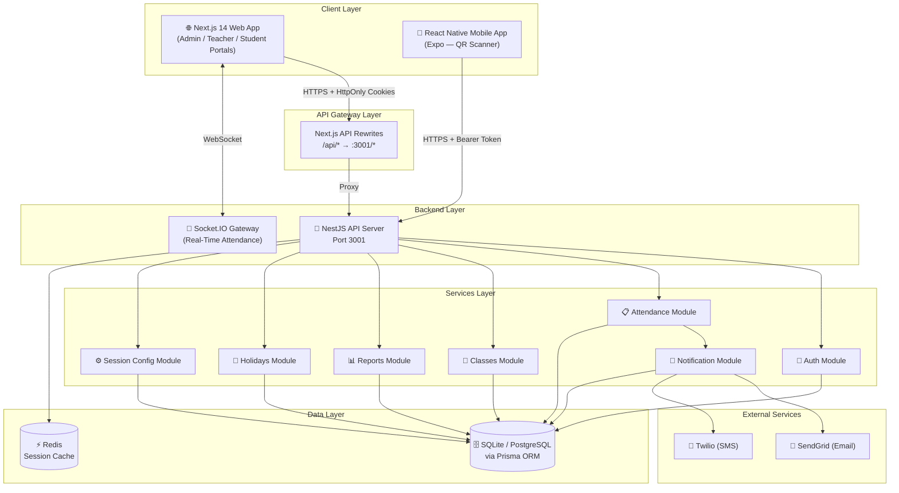

### Monorepo Structure

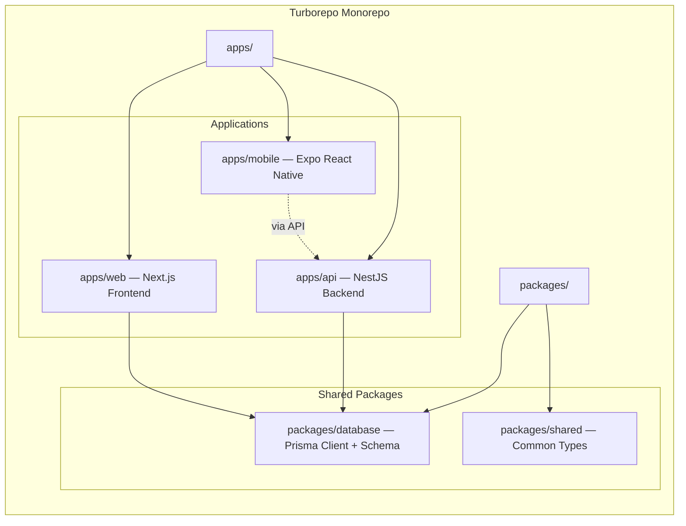

### Technology Stack

| Layer | Technology | Purpose |
|-------|-----------|---------|
| **Frontend (Web)** | Next.js 14, React, Tailwind CSS, Recharts | Admin/Teacher/Student dashboards, SSR |
| **Frontend (Mobile)** | Expo, React Native, expo-camera | QR scanning for teachers on mobile |
| **Backend** | NestJS 10, TypeScript | REST API, WebSocket gateway |
| **ORM** | Prisma | Type-safe database access |
| **Database** | SQLite (dev) / PostgreSQL 15 (prod) | Persistent data storage |
| **Cache** | Redis 7 | Session caching |
| **Auth** | Passport.js, JWT, bcryptjs | Authentication & token management |
| **Real-Time** | Socket.IO | Live attendance updates |
| **Email** | SendGrid | Absence notification emails |
| **SMS** | Twilio | Absence notification SMS |
| **QR Scanning** | @zxing/library (web), expo-barcode-scanner (mobile) | Camera-based QR decoding |
| **PDF/Export** | jsPDF, ExcelJS | ID cards, attendance report exports |
| **Build** | Turborepo | Monorepo orchestration |
| **Containerization** | Docker Compose | PostgreSQL + Redis services |

---

## 4. Backend Workflow

### Module Dependency Graph

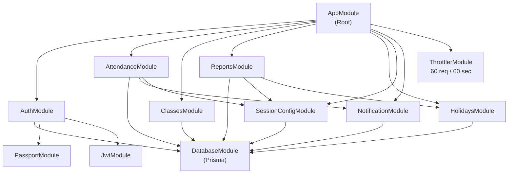

### Request Lifecycle

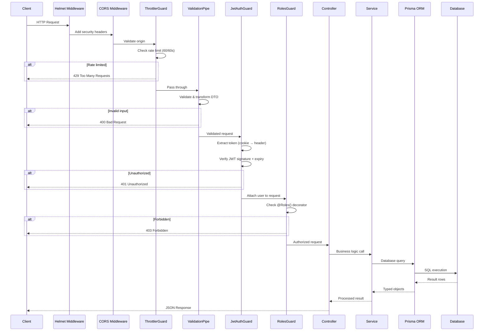

### Backend Modules Detail

#### Auth Module
- **Password Storage**: bcrypt with 12 salt rounds
- **Access Token**: JWT signed with `JWT_SECRET`, 15-minute TTL
- **Refresh Token**: 40-byte cryptographic random hex, stored in DB, 7-day TTL
- **Token Rotation**: Each refresh deletes old token and issues new pair
- **Logout**: Revokes ALL user refresh tokens (logout everywhere)
- **User Roles**: ADMIN, TEACHER, STUDENT, PARENT, PRINCIPAL, VICE_PRINCIPAL, OFFICER, LIBRARIAN, SECURITY, CLEANER, GARDENER, COOK, DRIVER, IT_STAFF, MAINTENANCE, NURSE, COUNSELOR, ACCOUNTANT, HR_MANAGER, ATHLETIC_COACH

#### Attendance Module
- **Session Model**: 4 sessions per day (Morning In/Out, Afternoon In/Out)
- **Auto-Late**: If check-in > 20 minutes after session start → `LATE`
- **Auto Day-Off**: Reads class schedule JSON; marks `DAY_OFF` if class doesn't meet today
- **Idempotent Scans**: Re-scanning preserves first checkInTime and original status
- **Bulk Operations**: Transactional batch processing for entire class
- **Real-Time**: WebSocket broadcasts to `class-{classId}` room on every scan
- **GPS**: Records latitude, longitude, and human-readable location label

#### Reports Module
- **Aggregation Levels**: Daily, Weekly, Monthly, Yearly
- **Grid View**: Students × 4 sessions with check-in/out times and status
- **Totals**: Present/Late/Absent/DayOff counts per period
- **Holiday-Aware**: Excludes holidays from absent calculations
- **Overtime Detection**: Auto-marks past sessions as ABSENT if unrecorded
- **Exports**: CSV (single-sheet) and XLSX (multi-sheet with formatting/styling)
- **Staff Reports**: Parallel reporting pipeline for staff attendance

---

## 5. Frontend Workflow

### Web Application Page Hierarchy

```mermaid
graph TD
    ROOT["/ (Landing Page)<br/>3 Portal Cards"]

    ROOT --> LOGIN["/login<br/>Email + Password"]

    LOGIN --> ADMIN["/admin<br/>Dashboard (10 Quick Actions)"]
    LOGIN --> TEACHER["/teacher<br/>Dashboard (My Classes)"]
    LOGIN --> STUDENT["/student<br/>Attendance History"]

    subgraph "Admin Portal"
        ADMIN --> A_DASH["/admin/dashboard<br/>Analytics & Charts"]
        ADMIN --> A_SEARCH["/admin/search<br/>Full-Text User Search"]
        ADMIN --> A_USERS["/admin/users<br/>User CRUD + CSV Import"]
        ADMIN --> A_CLASS["/admin/classes<br/>Class Management"]
        ADMIN --> A_ATT["/admin/attendance<br/>QR Scanner"]
        ADMIN --> A_ATT_EDIT["/admin/attendance/edit<br/>Spreadsheet Editor"]
        ADMIN --> A_STAFF["/admin/staff-attendance<br/>Staff QR Scanner"]
        ADMIN --> A_STAFF_EDIT["/admin/staff-attendance/edit<br/>Staff Grid Editor"]
        ADMIN --> A_RPT["/admin/reports<br/>Student Reports + Export"]
        ADMIN --> A_STAFF_RPT["/admin/staff-reports<br/>Staff Reports + Export"]
        ADMIN --> A_QR["/admin/qr-codes<br/>ID Card Generator"]
        ADMIN --> A_CARD["/admin/card-designer<br/>Card Template Editor"]
        ADMIN --> A_HOL["/admin/holidays<br/>Holiday Calendar"]
        ADMIN --> A_SESS["/admin/session-settings<br/>Session Time Config"]
        ADMIN --> A_NOTIF["/admin/notifications<br/>Email/SMS Settings"]
        ADMIN --> A_AUDIT["/admin/audit<br/>Audit Log Viewer"]
        ADMIN --> A_SET["/admin/settings<br/>Cache Management"]
    end

    subgraph "Teacher Portal"
        TEACHER --> T_CLASS["/teacher/classes<br/>My Classes + Students"]
        TEACHER --> T_ATT["/teacher/attendance<br/>QR Scanner (My Classes)"]
        TEACHER --> T_STAFF["/teacher/staff-attendance<br/>Staff QR Scanner"]
        TEACHER --> T_RPT["/teacher/reports<br/>Attendance Grid + Export"]
        TEACHER --> T_STAFF_RPT["/teacher/staff-reports<br/>Staff Reports"]
        TEACHER --> T_SESS["/teacher/session-settings<br/>Per-Class Session Override"]
    end

    subgraph "Student Portal"
        STUDENT --> S_HIST["Attendance History Table<br/>Status Badge + Stats"]
    end
```

### Mobile Application Flow

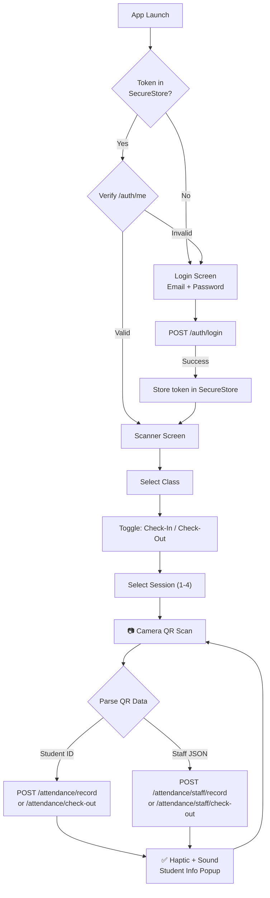

### Frontend-Backend Communication

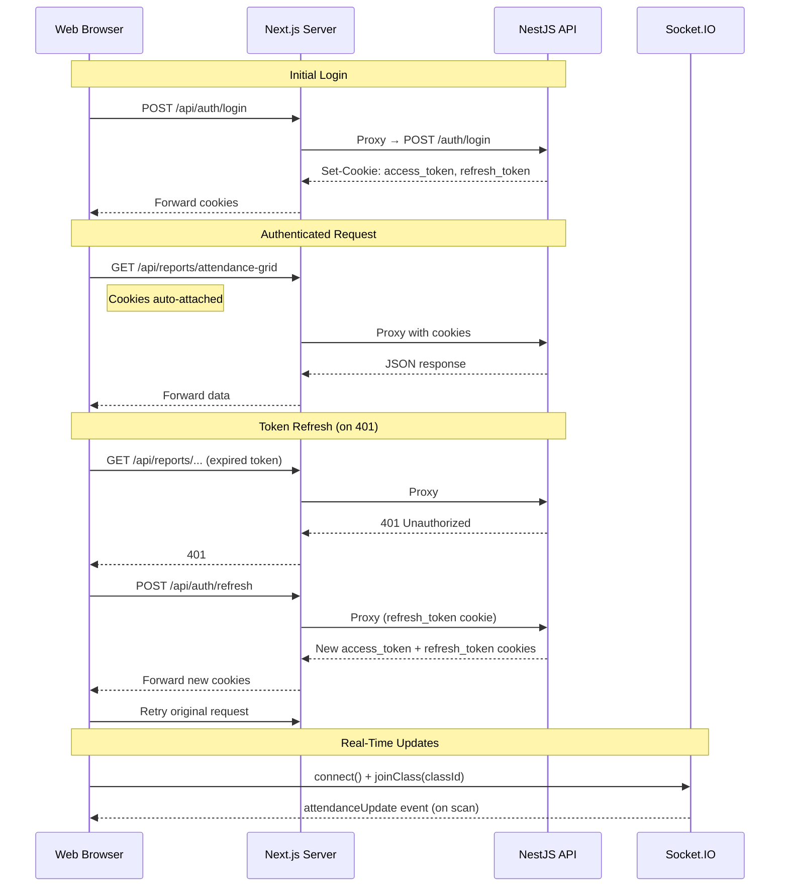

---

## 6. Authentication & Authorization Flow

### Login & Token Lifecycle

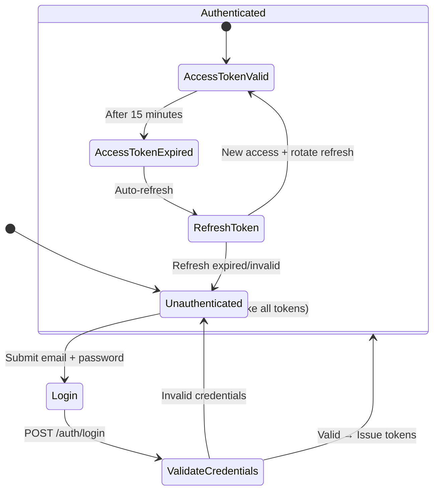

### Role-Based Access Matrix

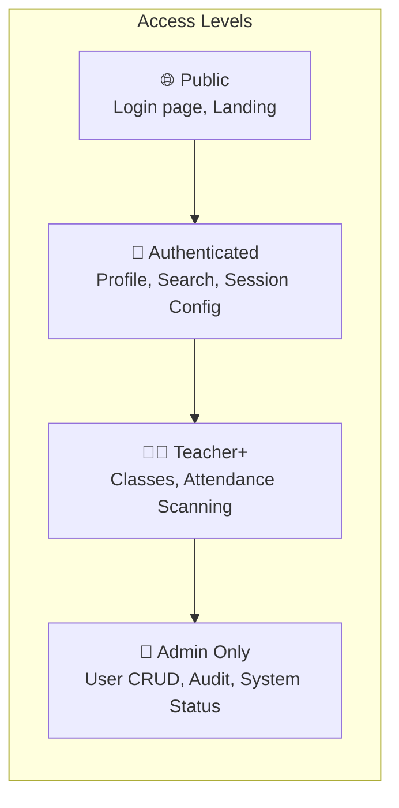

| Endpoint Category | Public | Student | Teacher | Admin |
|------------------|--------|---------|---------|-------|
| Login / Refresh | ✅ | ✅ | ✅ | ✅ |
| View own profile | ❌ | ✅ | ✅ | ✅ |
| View own attendance | ❌ | ✅ | ✅ | ✅ |
| Scan attendance | ❌ | ❌ | ✅ | ✅ |
| Manage own classes | ❌ | ❌ | ✅ | ✅ |
| View all reports | ❌ | ❌ | ❌ | ✅ |
| Register users | ❌ | ❌ | ❌ | ✅ |
| Bulk user import | ❌ | ❌ | ❌ | ✅ |
| Delete users/classes | ❌ | ❌ | ❌ | ✅ |
| Manage holidays | ❌ | ❌ | ❌ | ✅ |
| View audit logs | ❌ | ❌ | ❌ | ✅ |
| System status | ❌ | ❌ | ❌ | ✅ |

---

## 7. Attendance Workflow

### Student Attendance Flow (QR Scan)

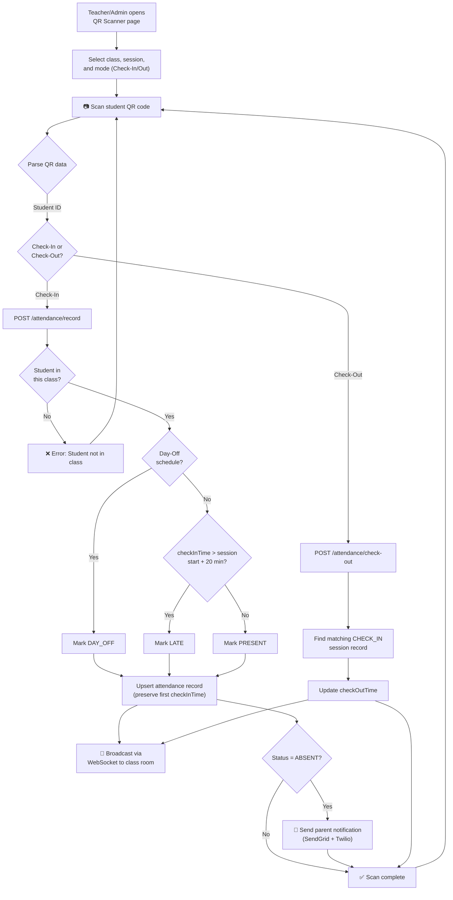

### Staff Auto-Scan Flow

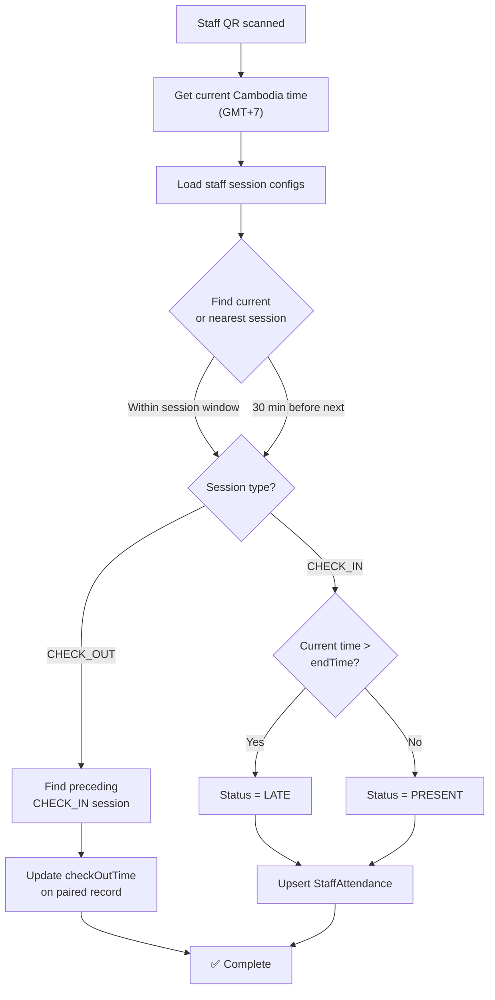

### Session Configuration Model

```
Session 1 — Morning CHECK_IN    → 07:00 - 07:15  (Student) / 07:00 - 07:30 (Staff)
Session 2 — Morning CHECK_OUT   → 12:00 - 12:15  (Student) / 11:30 - 12:00 (Staff)
Session 3 — Afternoon CHECK_IN  → 13:00 - 13:15  (Student) / 13:00 - 13:30 (Staff)
Session 4 — Afternoon CHECK_OUT → 17:00 - 17:15  (Student) / 17:00 - 17:30 (Staff)
```

Session configs are hierarchical: **Per-Class Override → Global Default → Hardcoded Fallback**

---

## 8. Data Flow Charts (Mermaid)

### Complete System Data Flow

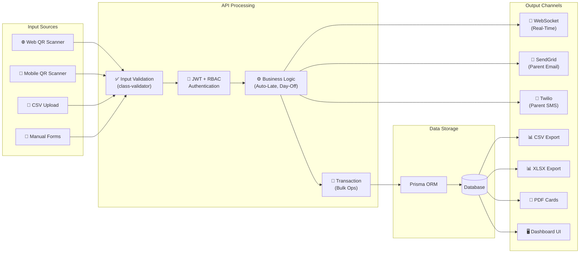

### Report Generation Flow

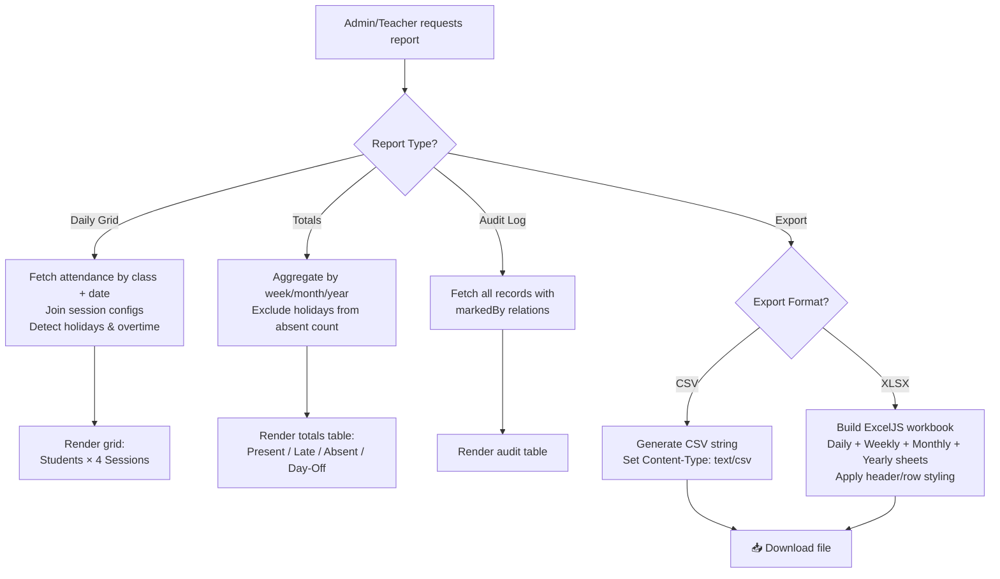

### Notification Flow

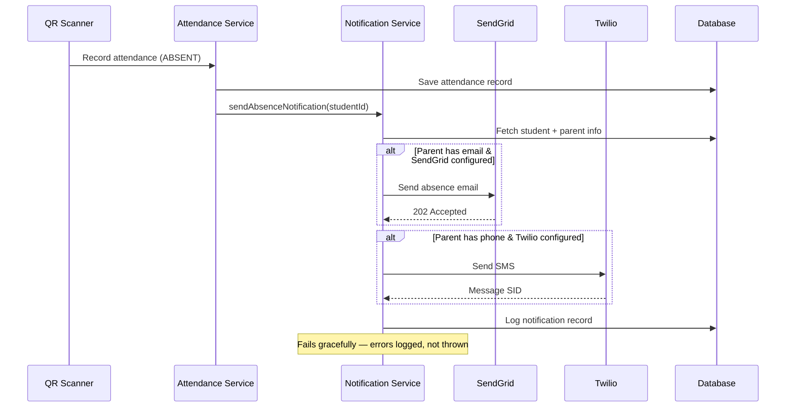

---

## 9. Database Schema

### Entity Relationship Diagram

```mermaid
erDiagram
    USER {
        string id PK "cuid()"
        string email UK
        string password "bcrypt hash"
        string name
        string phone
        string photo
        string role "ADMIN|TEACHER|STUDENT|..."
        datetime createdAt
        datetime updatedAt
    }

    STUDENT {
        string id PK
        string studentNumber "e.g., 0001"
        string userId FK UK
        string classId FK "nullable"
        string parentId FK "nullable"
        string qrCode UK
        string photo
        string sex "MALE|FEMALE"
    }

    CLASS {
        string id PK
        string name
        string subject
        string teacherId FK
        string schedule "JSON — weekly schedule"
    }

    ATTENDANCE {
        string id PK
        string studentId FK
        string classId FK
        datetime date
        int session "1-4"
        string status "PRESENT|LATE|ABSENT|..."
        datetime checkInTime
        datetime checkOutTime
        string markedById FK
        float scanLatitude
        float scanLongitude
        string scanLocation
    }

    STAFF_ATTENDANCE {
        string id PK
        string userId FK
        datetime date
        int session "1-4"
        string status
        datetime checkInTime
        datetime checkOutTime
        string markedById FK
        float scanLatitude
        float scanLongitude
        string scanLocation
    }

    SESSION_CONFIG {
        string id PK
        string classId FK "null = global"
        int session "1-4"
        string type "CHECK_IN|CHECK_OUT"
        string startTime "HH:mm"
        string endTime "HH:mm"
        string scope "CLASS|STAFF"
    }

    HOLIDAY {
        string id PK
        datetime date
        string name
        string description
        string type "HOLIDAY|SCHOOL_EVENT|CUSTOM"
        string createdById
    }

    NOTIFICATION {
        string id PK
        string userId FK
        string message
        string type "absence|late"
        datetime sentAt
        datetime readAt
    }

    REFRESH_TOKEN {
        string id PK
        string token UK "40-byte hex"
        string userId FK
        datetime expiresAt
    }

    USER ||--o{ STUDENT : "has profile"
    USER ||--o{ CLASS : "teaches"
    USER ||--o{ REFRESH_TOKEN : "has tokens"
    USER ||--o{ NOTIFICATION : "receives"
    USER ||--o{ STAFF_ATTENDANCE : "records"
    STUDENT }o--|| USER : "belongs to"
    STUDENT }o--o| USER : "has parent"
    STUDENT }o--o| CLASS : "enrolled in"
    STUDENT ||--o{ ATTENDANCE : "has records"
    CLASS ||--o{ ATTENDANCE : "has records"
    CLASS ||--o{ SESSION_CONFIG : "has configs"
    CLASS ||--o{ STUDENT : "has students"

    ATTENDANCE }o--|| USER : "marked by"
    STAFF_ATTENDANCE }o--|| USER : "marked by"
```

### Unique Constraints

| Table | Constraint | Purpose |
|-------|-----------|---------|
| `Attendance` | `[studentId, classId, date, session]` | One record per student per session per day |
| `StaffAttendance` | `[userId, date, session]` | One record per staff per session per day |
| `SessionConfig` | `[classId, session, scope]` | One config per session per class/scope |
| `Holiday` | `[date, name]` | No duplicate holidays |
| `RefreshToken` | `[token]` | Unique token values |
| `User` | `[email]` | Unique login emails |
| `Student` | `[userId]`, `[qrCode]` | One profile per user, unique QR |

---

## 10. Security Architecture

### Security Layer Overview

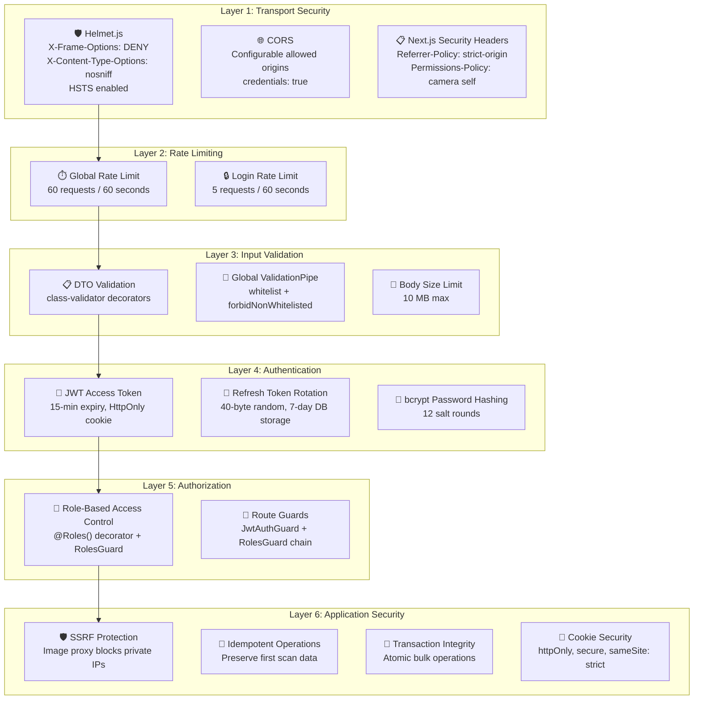

### Security Feature Details

#### Layer 1 — Transport & Headers

| Feature | Configuration | Purpose |
|---------|-------------|---------|
| Helmet.js | `X-Frame-Options: DENY` | Prevents clickjacking |
| | `X-Content-Type-Options: nosniff` | Prevents MIME-type sniffing |
| | `Strict-Transport-Security` | Forces HTTPS |
| CORS | `CORS_ORIGINS` env, `credentials: true` | Controls cross-origin access |
| Next.js Headers | `Referrer-Policy: strict-origin-when-cross-origin` | Limits referrer leakage |
| | `Permissions-Policy: camera=(self)` | Restricts camera to same origin |
| Compression | gzip/brotli | Reduces response size |

#### Layer 2 — Rate Limiting

| Scope | Config | Limit |
|-------|--------|-------|
| Global (all endpoints) | `ThrottlerModule` | 60 requests per 60 seconds per IP |
| Login endpoint | `@Throttle({ default: { limit: 5, ttl: 60000 } })` | 5 attempts per 60 seconds |

#### Layer 3 — Input Validation

| Feature | Implementation |
|---------|---------------|
| DTO validation | `@IsEmail()`, `@MinLength(6)`, `@MaxLength(128)`, `@IsIn()` |
| Global pipe | `whitelist: true` — strips unknown properties |
| | `forbidNonWhitelisted: true` — rejects extra fields |
| | `transform: true` — auto-type conversion |
| Body limit | `express.json({ limit: '10mb' })` |

#### Layer 4 — Authentication

| Feature | Detail |
|---------|--------|
| Access Token | JWT, HS256, 15-min expiry, secret from `JWT_SECRET` env |
| Refresh Token | 40 bytes `crypto.randomBytes()`, stored in DB with `expiresAt` |
| Token Rotation | Old refresh token deleted on use → prevents replay |
| Cookie Delivery | `httpOnly`, `secure` (production), `sameSite: strict` (production) / `lax` (dev) |
| Access Token Path | `/` (available to all API routes) |
| Refresh Token Path | `/api/auth/refresh` (restricted scope) |
| Mobile Auth | `Authorization: Bearer <token>` header fallback |
| Password Storage | bcryptjs, 12 salt rounds |
| Token Cleanup | Expired tokens deleted during validation |

#### Layer 5 — Authorization (RBAC)

```typescript
// Decorator usage
@UseGuards(JwtAuthGuard, RolesGuard)
@Roles('ADMIN')
@Post('register')
async register(@Body() dto: RegisterDto) { ... }
```

Guard chain: `JwtAuthGuard` → extract & verify JWT → `RolesGuard` → check `@Roles()` metadata

#### Layer 6 — Application Security

| Feature | Implementation |
|---------|---------------|
| SSRF Protection | Image proxy validates URLs, blocks: `localhost`, `127.0.0.1`, `0.0.0.0`, `10.x.x.x`, `192.168.x.x`, `172.16-31.x.x`, `::1` |
| Idempotent Scans | Upsert logic preserves first `checkInTime` and original status |
| Cascade Deletes | User deletion cascades: Student → Attendance, StaffAttendance, Notifications, RefreshTokens |
| Transaction Safety | Bulk attendance operations wrapped in `prisma.$transaction()` |
| Production Logging | Only `['error', 'warn']` levels in production |
| No Client-Side Tokens | Web app stores ZERO tokens in `localStorage` — all via HttpOnly cookies |
| Concurrent Refresh Protection | Frontend queues requests during token refresh to prevent race conditions |

### Security Architecture — Threat Model

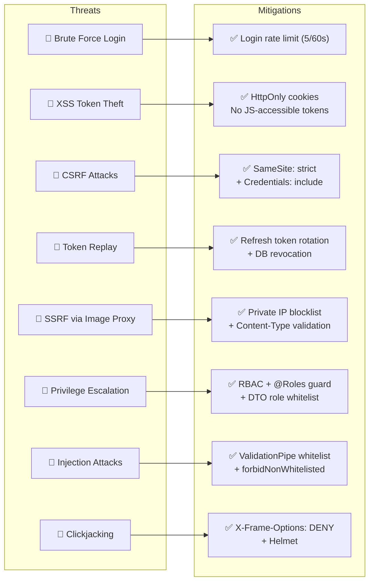

---

## 11. API Endpoint Reference

### Auth (`/auth`)

| Method | Path | Auth | Rate Limit | Description |
|--------|------|------|------------|-------------|
| POST | `/auth/login` | Public | 5/60s | Authenticate user, set cookies |
| POST | `/auth/refresh` | Cookie | Global | Rotate tokens |
| POST | `/auth/logout` | JWT | Global | Revoke all refresh tokens |
| POST | `/auth/register` | Admin | Global | Create single user |
| POST | `/auth/users/bulk` | Admin | Global | Bulk create users |
| GET | `/auth/me` | JWT | Global | Get current user info |
| GET | `/auth/users` | Admin | Global | List users by role |
| GET | `/auth/users/search` | JWT | Global | Search by name/email/phone |
| PUT | `/auth/users/:id` | Admin | Global | Update user details |
| PUT | `/auth/users/:id/photo` | JWT | Global | Update user photo |
| DELETE | `/auth/users/:id` | Admin | Global | Delete user + cascade |

### Attendance (`/attendance`)

| Method | Path | Auth | Description |
|--------|------|------|-------------|
| POST | `/attendance/record` | JWT | Record student check-in |
| POST | `/attendance/bulk` | JWT | Bulk record class attendance |
| POST | `/attendance/check-out` | JWT | Record student check-out |
| GET | `/attendance/records` | JWT | Get class attendance by date |
| PATCH | `/attendance/update` | JWT | Edit attendance record |
| POST | `/attendance/create-record` | Admin | Admin-create attendance record |
| POST | `/attendance/staff/record` | JWT | Record staff check-in |
| POST | `/attendance/staff/check-out` | JWT | Record staff check-out |
| POST | `/attendance/staff/auto-scan` | JWT | Smart staff auto-scan |
| GET | `/attendance/staff/records` | JWT | Get staff attendance by date |
| PATCH | `/attendance/staff/update` | JWT | Edit staff attendance |
| POST | `/attendance/staff/create-record` | JWT | Admin-create staff record |

### Classes (`/classes`)

| Method | Path | Auth | Description |
|--------|------|------|-------------|
| POST | `/classes` | Admin | Create class |
| GET | `/classes` | JWT | List classes (optional teacherId filter) |
| PUT | `/classes/:id` | JWT | Update class |
| DELETE | `/classes/:id` | Admin | Delete class + unassign students |
| GET | `/classes/:id/students` | JWT | List students in class |
| POST | `/classes/:id/students` | JWT | Add student to class |
| POST | `/classes/:id/students/bulk-csv` | JWT | Import students via CSV |
| PATCH | `/classes/:classId/students/:studentId` | JWT | Update student details |
| DELETE | `/classes/:id/students/:studentId` | JWT | Remove student from class |
| GET | `/classes/:id/available-students` | JWT | List unassigned students |

### Reports (`/reports`)

| Method | Path | Auth | Description |
|--------|------|------|-------------|
| GET | `/reports/system-status` | Admin | System health & counts |
| GET | `/reports/attendance-summary` | JWT | Summary counts by class/date |
| GET | `/reports/student-attendance` | JWT | Student attendance history |
| GET | `/reports/class-summaries` | JWT | Per-class breakdown |
| GET | `/reports/daily-summary` | JWT | School-wide daily summary |
| GET | `/reports/class-student-detail` | JWT | Student detail over date range |
| GET | `/reports/attendance-grid` | JWT | Students × 4 sessions grid |
| GET | `/reports/attendance-totals` | JWT | Week/month/year totals |
| GET | `/reports/audit-logs` | Admin | Full audit trail |
| GET | `/reports/export` | JWT | CSV export by period |
| GET | `/reports/export-grid` | JWT | CSV grid export |
| GET | `/reports/export-xlsx` | JWT | XLSX multi-sheet export |
| GET | `/reports/staff-attendance-grid` | JWT | Staff records by date |
| GET | `/reports/staff-attendance-daily-grid` | JWT | Staff daily grid |
| GET | `/reports/staff-attendance-totals` | JWT | Staff period totals |
| GET | `/reports/export-staff-grid` | JWT | CSV staff grid |
| GET | `/reports/export-staff-xlsx` | JWT | XLSX staff export |
| GET | `/reports/export-staff-period` | JWT | CSV staff period export |

### Holidays (`/holidays`)

| Method | Path | Auth | Description |
|--------|------|------|-------------|
| GET | `/holidays` | JWT | List by year (optional month) |
| GET | `/holidays/check` | JWT | Check if date is holiday |
| POST | `/holidays` | Admin | Create holiday |
| PUT | `/holidays/:id` | Admin | Update holiday |
| DELETE | `/holidays/:id` | Admin | Delete holiday |

### Session Config (`/session-config`)

| Method | Path | Auth | Description |
|--------|------|------|-------------|
| GET | `/session-config` | JWT | Get configs (class fallback to global) |
| GET | `/session-config/global` | JWT | Get global defaults |
| GET | `/session-config/staff` | JWT | Get staff defaults |
| POST | `/session-config` | JWT | Save all 4 session configs |
| DELETE | `/session-config` | JWT | Delete class overrides |

---

## 12. Deployment Architecture

### Docker Compose Setup

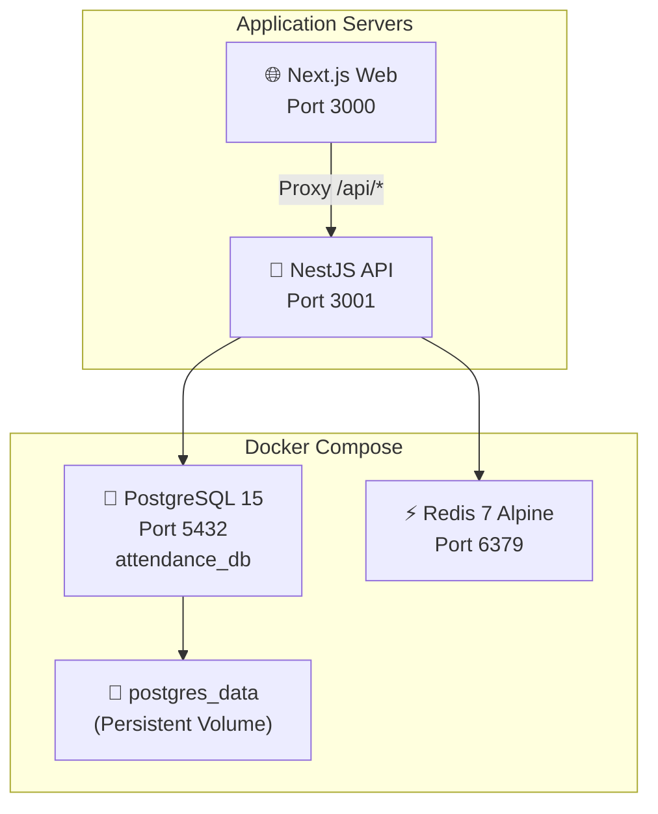

### Environment Variables

| Variable | Service | Purpose |
|----------|---------|---------|
| `DATABASE_URL` | API | Prisma connection string |
| `JWT_SECRET` | API | JWT signing secret |
| `JWT_ACCESS_EXPIRY` | API | Access token TTL (default: 15m) |
| `PORT` | API | API server port (default: 3001) |
| `CORS_ORIGINS` | API | Allowed CORS origins |
| `COOKIE_SECURE` | API | Force secure cookies |
| `SENDGRID_API_KEY` | API | Email notification service |
| `TWILIO_ACCOUNT_SID` | API | SMS service account |
| `TWILIO_AUTH_TOKEN` | API | SMS service token |
| `TWILIO_PHONE_NUMBER` | API | SMS sender number |
| `NEXT_PUBLIC_API_URL` | Web | API base URL for client |

---

## Appendix: Status Codes Reference

| Status | Meaning | Used For |
|--------|---------|----------|
| `PRESENT` | On time | Within session window |
| `LATE` | Arrived late | > 20 min after session start |
| `ABSENT` | Not present | No scan recorded (or manual) |
| `PERMISSION` | Excused absence | Teacher/admin granted leave |
| `DAY_OFF` | Scheduled off | Class doesn't meet this day |

### Daily Status Determination Logic

| Condition | Daily Status |
|-----------|-------------|
| Morning + Afternoon present | **Present** |
| 2+ late sessions | **Present (Late)** |
| 3+ late sessions | **Absent (Exceeded Late Limit)** |
| Morning only | **Half-Day Present (Morning Only)** |
| Afternoon only | **Half-Day Present (Afternoon Only)** |
| All sessions DAY_OFF | **Day Off** |
| No attendance recorded | **Absent** |

---

> **Document generated**: March 24, 2026  
> **System**: SchoolSync Attendance Management System  
> **Architecture**: Turborepo Monorepo (NestJS + Next.js + Expo)
